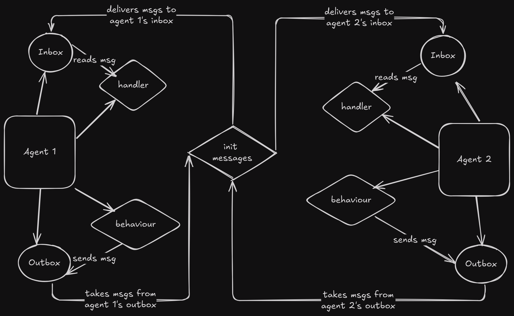

# Solution Architecture



## Steps to run the project

1. Run the agents

```bash
python3 -m src.autonomous_agent.main
```

2. Run the tests

```bash
python3 -m tests.test_autonomous_agent
```

## Design choices

1. Queues for inbox/outbox

- Queues handle asynchronous message passing effectively, thus allowing the Autonomous agents to operate in async manner where data can arrive at unpredictable times.
- Queues manage the async behaviour to provide reliable mechanism to read and write messages

2. Threading

- Threading allows different functionalities of the autonomous agent (message handler, behaviour) to be managed independently, thus allowing the Autonomous agents to perform multiple complex tasks concurrently.

Thus, by using queues and threading it allows us to create an architecture which is both flexible and scalable.

### Design Questions

1.Is the indirect connection between handler and behaviour expected or not?
For example: The current design handles the messages from agent A's outbox and delivers to the agent B's inbox
